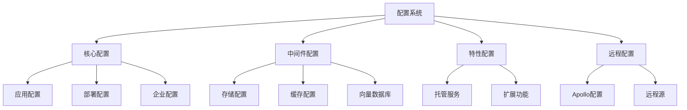

# Configs 配置系统设计文档

## 整体架构



## 配置模块说明

### 1. 核心配置

#### app_config.py
- **功能**: 应用核心配置
```python
class AppConfig:
    """应用配置"""
    # 基础配置
    APP_NAME = "Dify"
    DEBUG = False
    SECRET_KEY = environ.get('SECRET_KEY')
    
    # 服务配置
    API_URL = environ.get('API_URL', 'http://localhost:5001')
    WEB_URL = environ.get('WEB_URL', 'http://localhost:3000')
    
    # 安全配置
    SECURITY_PASSWORD_SALT = environ.get('SECURITY_PASSWORD_SALT')
    JWT_SECRET_KEY = environ.get('JWT_SECRET_KEY')
```

### 2. 中间件配置

#### middleware/storage/
- **功能**: 存储配置管理
```python
class StorageConfig:
    """存储配置基类"""
    @abstractmethod
    def get_client(self) -> Any:
        """获取存储客户端"""
        pass

class S3StorageConfig(StorageConfig):
    """AWS S3 存储配置"""
    def __init__(self):
        self.access_key = environ.get('S3_ACCESS_KEY')
        self.secret_key = environ.get('S3_SECRET_KEY')
        self.bucket = environ.get('S3_BUCKET')
        self.region = environ.get('S3_REGION')
```

#### middleware/vdb/
- **功能**: 向量数据库配置
```python
class VectorDBConfig:
    """向量数据库配置基类"""
    @abstractmethod
    def get_connection(self) -> Any:
        """获取数据库连接"""
        pass

class WeaviateConfig(VectorDBConfig):
    """Weaviate 配置"""
    def __init__(self):
        self.url = environ.get('WEAVIATE_URL')
        self.api_key = environ.get('WEAVIATE_API_KEY')
        self.batch_size = int(environ.get('WEAVIATE_BATCH_SIZE', 100))
```

### 3. 特性配置

#### feature/hosted_service/
- **功能**: 托管服务配置
```python
class HostedServiceConfig:
    """托管服务配置"""
    # 服务限制
    MAX_APPLICATIONS = 10
    MAX_TOKENS_PER_MIN = 1000
    MAX_REQUESTS_PER_DAY = 10000
    
    # 计费配置
    BILLING_ENABLED = True
    TRIAL_DAYS = 14
```

### 4. 远程配置

#### remote_settings_sources/apollo/
- **功能**: Apollo 配置中心客户端
```python
class ApolloClient:
    """Apollo 配置客户端"""
    
    def __init__(self, app_id: str, cluster: str = 'default'):
        self.app_id = app_id
        self.cluster = cluster
        self.cache = {}
    
    async def get_config(self, key: str) -> Any:
        """获取配置"""
        if key in self.cache:
            return self.cache[key]
            
        value = await self._fetch_from_apollo(key)
        self.cache[key] = value
        return value
```

## 配置加载机制

### 1. 配置优先级
```python
class ConfigLoader:
    """配置加载器"""
    
    def load_config(self):
        """加载配置"""
        # 1. 加载默认配置
        config = self.load_default_config()
        
        # 2. 加载环境变量
        config.update(self.load_env_config())
        
        # 3. 加载远程配置
        remote_config = self.load_remote_config()
        config.update(remote_config)
        
        return config
```

### 2. 环境变量处理
```python
class EnvLoader:
    """环境变量加载器"""
    
    def load_env(self, prefix: str = None):
        """加载环境变量"""
        config = {}
        for key, value in environ.items():
            if prefix and not key.startswith(prefix):
                continue
                
            config[key] = self.parse_value(value)
        return config
```

## 配置验证

### 1. 配置校验器
```python
class ConfigValidator:
    """配置验证器"""
    
    def validate_storage_config(self, config: dict):
        """验证存储配置"""
        required_fields = ['type', 'bucket']
        for field in required_fields:
            if field not in config:
                raise ValueError(f"Missing required field: {field}")
                
        if config['type'] == 's3':
            self.validate_s3_config(config)
```

### 2. 类型转换
```python
class ConfigConverter:
    """配置转换器"""
    
    def convert_value(self, value: str, target_type: Type):
        """转换配置值类型"""
        if target_type == bool:
            return value.lower() in ('true', '1', 'yes')
            
        if target_type == int:
            return int(value)
            
        return value
```

## 配置管理

### 1. 配置缓存
```python
class ConfigCache:
    """配置缓存"""
    
    def __init__(self):
        self.cache = {}
        self.ttl = {}
    
    def get(self, key: str) -> Optional[Any]:
        """获取缓存的配置"""
        if key not in self.cache:
            return None
            
        if self.is_expired(key):
            del self.cache[key]
            return None
            
        return self.cache[key]
```

### 2. 配置更新
```python
class ConfigManager:
    """配置管理器"""
    
    def update_config(self, key: str, value: Any):
        """更新配置"""
        # 验证配置
        self.validator.validate(key, value)
        
        # 更新配置
        self.config[key] = value
        
        # 通知监听器
        self.notify_listeners(key, value)
```

## 最佳实践

### 1. 配置定义
- 使用类型注解
- 提供默认值
- 文档注释
- 验证规则

### 2. 安全考虑
- 敏感信息加密
- 访问控制
- 审计日志
- 备份恢复

### 3. 性能优化
- 配置缓存
- 懒加载
- 批量更新
- 异步加载

### 4. 可维护性
- 模块化组织
- 统一接口
- 版本管理
- 配置文档

## 开发指南

### 1. 添加新配置
1. 定义配置类
2. 实现验证规则
3. 添加默认值
4. 更新文档

### 2. 使用配置
1. 注入配置
2. 读取配置
3. 处理异常
4. 优雅降级

### 3. 调试配置
1. 配置日志
2. 环境检查
3. 配置导出
4. 问题诊断

## 注意事项

### 1. 配置设计
- 合理分层
- 职责单一
- 易于扩展
- 向后兼容

### 2. 安全性
- 密钥保护
- 权限控制
- 数据校验
- 错误处理

### 3. 运维支持
- 配置备份
- 版本控制
- 变更追踪
- 监控告警
