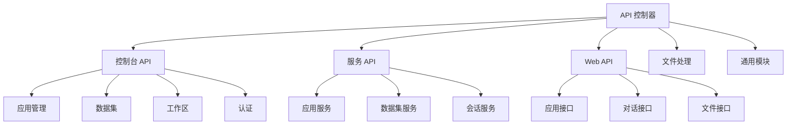

# Controllers API 控制器设计文档

## 整体架构



## API 分层设计

### 1. Console API (console/)
- **功能**: 提供控制台管理接口
- **模块结构**:
  ```
  console/
  ├── app/                  # 应用管理
  │   ├── app.py           # 应用基础操作
  │   ├── conversation.py   # 对话管理
  │   └── workflow.py      # 工作流管理
  ├── datasets/            # 数据集管理
  ├── workspace/           # 工作区管理
  ├── auth/               # 认证相关
  └── billing/            # 计费相关
  ```
- **设计特点**:
  - RESTful API 设计
  - 权限控制
  - 完整的 CRUD 操作

### 2. Service API (service_api/)
- **功能**: 提供服务层 API
- **模块结构**:
  ```
  service_api/
  ├── app/                 # 应用服务
  │   ├── completion.py    # 补全服务
  │   ├── conversation.py  # 对话服务
  │   └── workflow.py     # 工作流服务
  └── dataset/            # 数据集服务
  ```
- **设计特点**:
  - 服务间通信
  - 高性能处理
  - 异步支持

### 3. Web API (web/)
- **功能**: 提供 Web 端接口
- **模块结构**:
  ```
  web/
  ├── app.py              # 应用接口
  ├── conversation.py     # 对话接口
  ├── message.py         # 消息处理
  └── workflow.py        # 工作流接口
  ```
- **设计特点**:
  - 用户交互接口
  - 实时通信
  - 会话管理

## 实现示例

### 1. API 路由定义
```python
from flask import Blueprint, request
from flask_restful import Resource, Api

class AppAPI(Resource):
    """应用管理接口"""
    
    def get(self, app_id):
        """获取应用信息"""
        return app_service.get_app(app_id)
    
    def post(self):
        """创建应用"""
        data = request.get_json()
        return app_service.create_app(data)
```

### 2. 中间件实现
```python
from functools import wraps
from flask import request

def auth_required(f):
    """认证中间件"""
    @wraps(f)
    def decorated(*args, **kwargs):
        auth_token = request.headers.get('Authorization')
        if not auth_token:
            return {'message': 'No auth token'}, 401
        # 验证 token
        return f(*args, **kwargs)
    return decorated
```

### 3. 响应处理
```python
class APIResponse:
    """API 响应封装"""
    
    @staticmethod
    def success(data=None, message="Success"):
        return {
            'code': 0,
            'message': message,
            'data': data
        }
    
    @staticmethod
    def error(message, code=400):
        return {
            'code': code,
            'message': message
        }, code
```

## 错误处理

### 1. 错误定义
```python
class APIError(Exception):
    """API 错误基类"""
    def __init__(self, message, code=400):
        self.message = message
        self.code = code
```

### 2. 错误处理器
```python
@app.errorhandler(APIError)
def handle_api_error(error):
    """API 错误处理"""
    return {
        'code': error.code,
        'message': error.message
    }, error.code
```

## 接口规范

### 1. 请求格式
```json
{
  "method": "POST",
  "path": "/api/v1/apps",
  "headers": {
    "Content-Type": "application/json",
    "Authorization": "Bearer token"
  },
  "body": {
    "name": "应用名称",
    "type": "应用类型",
    "config": {}
  }
}
```

### 2. 响应格式
```json
{
  "code": 0,
  "message": "Success",
  "data": {
    "id": "app_id",
    "name": "应用名称",
    "created_at": "2025-03-27T00:39:06Z"
  }
}
```

## 安全机制

### 1. 认证机制
- Token 认证
- OAuth 认证
- API Key 认证

### 2. 权限控制
- 角色基础访问控制
- 资源访问控制
- 操作权限控制

### 3. 数据校验
- 输入验证
- 参数检查
- 类型转换

## 性能优化

### 1. 缓存策略
- 响应缓存
- 数据缓存
- 查询缓存

### 2. 并发处理
- 异步处理
- 任务队列
- 连接池

### 3. 限流机制
- 请求限流
- 并发限制
- 资源控制

## 测试规范

### 1. 单元测试
- 接口测试
- 参数测试
- 错误测试

### 2. 集成测试
- 流程测试
- 性能测试
- 压力测试

## 开发指南

### 1. 添加新接口
1. 定义路由
2. 实现处理器
3. 添加文档
4. 编写测试

### 2. 错误处理
1. 定义错误类型
2. 实现错误处理
3. 添加日志
4. 返回正确响应

### 3. 接口维护
1. 版本管理
2. 兼容处理
3. 废弃提醒
4. 文档更新
