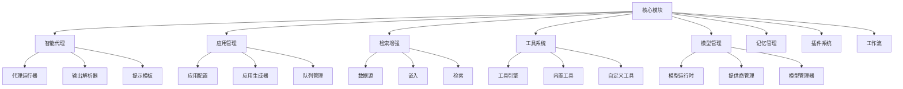

# Core 核心模块设计文档

## 整体架构



## 核心模块说明

### 1. 智能代理系统 (agent/)
- **功能**: 实现智能代理的核心逻辑
- **主要组件**:
  ```
  agent/
  ├── base_agent_runner.py    # 代理运行器基类
  ├── cot_agent_runner.py     # Chain of Thought 代理实现
  ├── fc_agent_runner.py      # Function Calling 代理实现
  ├── strategy/               # 代理策略实现
  ├── prompt/                 # 提示词模板
  └── output_parser/         # 输出解析器
  ```
- **实现原理**:
  - 基于 Chain of Thought 和 Function Calling 两种主要范式
  - 支持多轮对话和上下文管理
  - 提供可扩展的策略接口

### 2. 应用管理系统 (app/)
- **功能**: 管理应用生命周期和配置
- **主要组件**:
  ```
  app/
  ├── app_config/            # 应用配置管理
  ├── apps/                  # 应用类型实现
  │   ├── chat/             # 对话应用
  │   ├── completion/       # 补全应用
  │   └── workflow/         # 工作流应用
  ├── entities/             # 数据实体定义
  └── features/            # 功能特性实现
  ```
- **实现原理**:
  - 模块化的应用配置管理
  - 支持多种应用类型
  - 可扩展的功能特性系统

### 3. RAG 检索增强系统 (rag/)
- **功能**: 实现文档检索和知识库增强
- **主要组件**:
  ```
  rag/
  ├── datasource/           # 数据源管理
  ├── embedding/            # 向量嵌入
  ├── retrieval/            # 检索实现
  ├── splitter/            # 文档分割
  └── rerank/              # 重排序优化
  ```
- **实现原理**:
  - 文档预处理和分块
  - 向量化和索引构建
  - 相似度检索和排序

### 4. 工具系统 (tools/)
- **功能**: 提供工具管理和执行框架
- **主要组件**:
  ```
  tools/
  ├── tool_engine.py        # 工具执行引擎
  ├── builtin_tool/         # 内置工具实现
  ├── custom_tool/          # 自定义工具支持
  └── plugin_tool/          # 插件工具集成
  ```
- **实现原理**:
  - 统一的工具注册和管理
  - 安全的执行环境
  - 可扩展的工具接口

### 5. 模型管理 (model_runtime/)
- **功能**: 管理 LLM 模型和运行时
- **主要组件**:
  ```
  model_runtime/
  ├── model_providers/      # 模型提供商
  ├── entities/             # 模型实体定义
  └── callbacks/           # 回调处理
  ```
- **实现原理**:
  - 统一的模型接口抽象
  - 多提供商支持
  - 运行时优化

### 6. 工作流系统 (workflow/)
- **功能**: 实现工作流定义和执行
- **主要组件**:
  ```
  workflow/
  ├── graph_engine/         # 工作流引擎
  ├── nodes/                # 节点定义
  └── callbacks/           # 执行回调
  ```
- **实现原理**:
  - DAG 工作流定义
  - 节点编排和执行
  - 状态管理和错误处理

## 代码示例

### 1. 代理实现
```python
class BaseAgentRunner:
    """代理运行器基类"""
    def __init__(self, strategy, prompt_template):
        self.strategy = strategy
        self.prompt_template = prompt_template
        
    async def run(self, context):
        """运行代理"""
        prompt = self.prompt_template.format(context)
        response = await self.strategy.execute(prompt)
        return self.parse_response(response)
```

### 2. 工具注册
```python
class ToolEngine:
    """工具引擎"""
    def register_tool(self, tool_cls):
        """注册工具"""
        tool = tool_cls()
        self.tools[tool.name] = tool
    
    async def execute_tool(self, tool_name, parameters):
        """执行工具"""
        tool = self.tools.get(tool_name)
        if not tool:
            raise ToolNotFoundError(tool_name)
        return await tool.run(**parameters)
```

### 3. RAG 实现
```python
class RetrievalSystem:
    """检索系统"""
    def __init__(self, embedder, index):
        self.embedder = embedder
        self.index = index
    
    async def retrieve(self, query, top_k=3):
        """检索相关文档"""
        query_vector = await self.embedder.embed(query)
        results = await self.index.search(query_vector, top_k)
        return self.rerank_results(results)
```

## 设计原则

### 1. 模块化设计
- 高内聚低耦合
- 清晰的职责划分
- 可插拔的组件架构

### 2. 扩展性设计
- 插件化架构
- 抽象接口定义
- 配置驱动开发

### 3. 性能优化
- 异步处理
- 缓存机制
- 资源池化

### 4. 安全性考虑
- 输入验证
- 运行时隔离
- 权限控制

## 开发指南

### 1. 添加新功能
1. 确定功能所属模块
2. 实现抽象接口
3. 注册到系统
4. 编写单元测试

### 2. 自定义扩展
1. 继承基类接口
2. 实现必要方法
3. 配置扩展点
4. 测试验证

### 3. 调试建议
1. 使用日志追踪
2. 断点调试
3. 单元测试
4. 性能分析

## 注意事项

### 1. 并发处理
- 使用异步编程
- 避免死锁
- 资源限制

### 2. 错误处理
- 异常传播
- 错误恢复
- 日志记录

### 3. 资源管理
- 连接池化
- 内存管理
- 超时控制

### 4. 测试要求
- 单元测试覆盖
- 集成测试
- 性能测试
