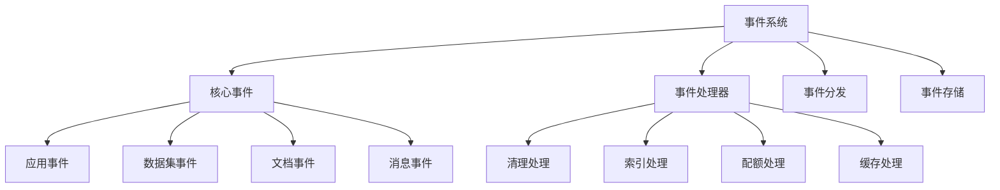

# Events 事件系统设计文档

## 整体架构



## 事件定义

### 1. 核心事件类型

#### app_event.py
- **功能**: 应用相关事件
```python
class AppEvent:
    """应用事件"""
    APP_CREATED = "app.created"
    APP_UPDATED = "app.updated"
    APP_DELETED = "app.deleted"
    
    def __init__(self, event_type: str, app_id: str, data: dict):
        self.type = event_type
        self.app_id = app_id
        self.data = data
        self.timestamp = datetime.utcnow()
```

#### dataset_event.py
- **功能**: 数据集相关事件
```python
class DatasetEvent:
    """数据集事件"""
    DATASET_CREATED = "dataset.created"
    DATASET_DELETED = "dataset.deleted"
    DOCUMENT_ADDED = "dataset.document_added"
    
    @classmethod
    def emit_dataset_created(cls, dataset_id: str):
        """发送数据集创建事件"""
        event = cls(cls.DATASET_CREATED, dataset_id)
        event_bus.publish(event)
```

### 2. 事件处理器

#### 文档索引处理器
```python
@event_handler(DocumentEvent.DOCUMENT_CREATED)
class CreateDocumentIndexHandler:
    """文档索引处理器"""
    
    async def handle(self, event: DocumentEvent):
        """处理文档创建事件"""
        document = await Document.get(event.document_id)
        if not document:
            return
            
        # 创建文档索引
        indexer = DocumentIndexer(document)
        await indexer.create_index()
```

#### 配额处理器
```python
@event_handler(MessageEvent.MESSAGE_CREATED)
class DeductQuotaHandler:
    """配额扣除处理器"""
    
    async def handle(self, event: MessageEvent):
        """处理消息创建事件"""
        # 获取用户配额
        quota = await Quota.get_user_quota(event.user_id)
        
        # 扣除配额
        await quota.deduct(
            amount=event.token_count,
            message_id=event.message_id
        )
```

### 3. 事件分发

#### 事件总线
```python
class EventBus:
    """事件总线"""
    
    def __init__(self):
        self.handlers = defaultdict(list)
        
    def subscribe(self, event_type: str, handler: Callable):
        """订阅事件"""
        self.handlers[event_type].append(handler)
        
    async def publish(self, event: Event):
        """发布事件"""
        handlers = self.handlers[event.type]
        for handler in handlers:
            try:
                await handler(event)
            except Exception as e:
                logger.error(f"Error handling event {event.type}: {str(e)}")
```

#### 事件装饰器
```python
def event_handler(event_type: str):
    """事件处理器装饰器"""
    def decorator(cls):
        event_bus.subscribe(event_type, cls().handle)
        return cls
    return decorator
```

## 事件处理流程

### 1. 事件发布
```python
class DocumentService:
    """文档服务"""
    
    async def create_document(self, data: dict) -> Document:
        """创建文档"""
        # 创建文档
        document = await Document.create(data)
        
        # 发送事件
        event = DocumentEvent(
            type=DocumentEvent.DOCUMENT_CREATED,
            document_id=document.id,
            data=document.to_dict()
        )
        await event_bus.publish(event)
        
        return document
```

### 2. 事件处理
```python
@event_handler(DocumentEvent.DOCUMENT_CREATED)
class DocumentIndexHandler:
    """文档索引处理器"""
    
    async def handle(self, event: DocumentEvent):
        """处理文档创建事件"""
        try:
            # 创建异步任务
            task = create_document_index_task.delay(
                document_id=event.document_id
            )
            
            # 更新文档状态
            await Document.update_status(
                event.document_id,
                status='indexing',
                task_id=task.id
            )
            
        except Exception as e:
            logger.error(f"Failed to handle document creation: {str(e)}")
            # 更新文档状态为失败
            await Document.update_status(
                event.document_id,
                status='index_failed',
                error=str(e)
            )
```

## 事件存储

### 1. 事件持久化
```python
class EventStore:
    """事件存储"""
    
    async def save_event(self, event: Event):
        """保存事件"""
        event_record = EventRecord(
            type=event.type,
            data=event.data,
            timestamp=event.timestamp
        )
        await event_record.save()
        
    async def get_events(self, 
                        event_type: str = None, 
                        start_time: datetime = None,
                        end_time: datetime = None) -> List[Event]:
        """查询事件"""
        query = EventRecord.query
        
        if event_type:
            query = query.filter_by(type=event_type)
            
        if start_time:
            query = query.filter(EventRecord.timestamp >= start_time)
            
        if end_time:
            query = query.filter(EventRecord.timestamp <= end_time)
            
        return await query.all()
```

### 2. 事件重放
```python
class EventReplay:
    """事件重放"""
    
    async def replay_events(self, 
                          start_time: datetime,
                          end_time: datetime):
        """重放事件"""
        events = await event_store.get_events(
            start_time=start_time,
            end_time=end_time
        )
        
        for event in events:
            await event_bus.publish(event)
```

## 最佳实践

### 1. 事件设计
- 明确事件边界
- 定义清晰接口
- 版本化管理
- 向后兼容

### 2. 错误处理
- 异常隔离
- 重试机制
- 死信队列
- 监控告警

### 3. 性能优化
- 异步处理
- 批量处理
- 事件缓冲
- 并发控制

### 4. 可靠性
- 事件持久化
- 幂等处理
- 事务完整性
- 顺序保证

## 开发指南

### 1. 添加新事件
1. 定义事件类型
2. 实现事件类
3. 注册处理器
4. 添加测试用例

### 2. 事件处理器
1. 创建处理器类
2. 实现处理逻辑
3. 注册到事件总线
4. 错误处理

### 3. 监控和调试
1. 日志记录
2. 性能指标
3. 追踪分析
4. 告警设置

## 注意事项

### 1. 设计考虑
- 事件粒度控制
- 处理器职责单一
- 避免循环依赖
- 考虑扩展性

### 2. 性能考虑
- 控制事件大小
- 适当的并发度
- 合理的重试策略
- 资源限制

### 3. 运维支持
- 监控覆盖
- 日志完备
- 告警及时
- 问题诊断
