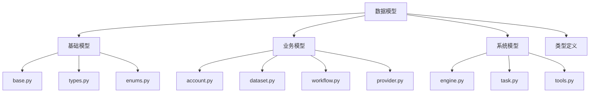

# Models 数据模型设计文档

## 整体架构



## 模型设计

### 1. 基础模型

#### base.py
- **功能**: 提供基础模型类
- **实现**:
```python
from sqlalchemy.ext.declarative import declarative_base
from datetime import datetime

class Base:
    """基础模型"""
    created_at = Column(DateTime, default=datetime.utcnow)
    updated_at = Column(DateTime, default=datetime.utcnow, onupdate=datetime.utcnow)
    
    def to_dict(self):
        """转换为字典"""
        return {c.name: getattr(self, c.name) for c in self.__table__.columns}

Base = declarative_base(cls=Base)
```

#### types.py
- **功能**: 自定义类型定义
```python
from sqlalchemy.types import TypeDecorator, String
import json

class JSONType(TypeDecorator):
    """JSON 类型"""
    impl = String
    
    def process_bind_param(self, value, dialect):
        if value is not None:
            return json.dumps(value)
    
    def process_result_value(self, value, dialect):
        if value is not None:
            return json.loads(value)
```

### 2. 业务模型

#### account.py
- **功能**: 账户相关模型
```python
class Account(Base):
    """账户模型"""
    __tablename__ = 'accounts'
    
    id = Column(String(32), primary_key=True)
    name = Column(String(255), nullable=False)
    email = Column(String(255), nullable=False, unique=True)
    password = Column(String(255), nullable=False)
    role = Column(String(32), nullable=False)
    status = Column(String(32), nullable=False)
    
    def verify_password(self, password):
        """验证密码"""
        return check_password_hash(self.password, password)
```

#### dataset.py
- **功能**: 数据集模型
```python
class Dataset(Base):
    """数据集模型"""
    __tablename__ = 'datasets'
    
    id = Column(String(32), primary_key=True)
    name = Column(String(255), nullable=False)
    description = Column(Text)
    type = Column(String(32), nullable=False)
    config = Column(JSONType)
    
    @property
    def document_count(self):
        """文档数量"""
        return Document.query.filter_by(dataset_id=self.id).count()
```

#### workflow.py
- **功能**: 工作流模型
```python
class Workflow(Base):
    """工作流模型"""
    __tablename__ = 'workflows'
    
    id = Column(String(32), primary_key=True)
    name = Column(String(255), nullable=False)
    definition = Column(JSONType, nullable=False)
    status = Column(String(32), nullable=False)
    
    def execute(self, context):
        """执行工作流"""
        engine = WorkflowEngine(self.definition)
        return engine.run(context)
```

### 3. 系统模型

#### engine.py
- **功能**: 引擎配置模型
```python
class Engine(Base):
    """引擎模型"""
    __tablename__ = 'engines'
    
    id = Column(String(32), primary_key=True)
    type = Column(String(32), nullable=False)
    config = Column(JSONType)
    status = Column(String(32), nullable=False)
    
    def initialize(self):
        """初始化引擎"""
        return EngineFactory.create(self.type, self.config)
```

#### task.py
- **功能**: 任务模型
```python
class Task(Base):
    """任务模型"""
    __tablename__ = 'tasks'
    
    id = Column(String(32), primary_key=True)
    type = Column(String(32), nullable=False)
    status = Column(String(32), nullable=False)
    result = Column(JSONType)
    error = Column(Text)
    
    def set_status(self, status, error=None):
        """设置任务状态"""
        self.status = status
        if error:
            self.error = str(error)
```

## 关系设计

### 1. 一对多关系
```python
class Team(Base):
    """团队模型"""
    __tablename__ = 'teams'
    
    id = Column(String(32), primary_key=True)
    name = Column(String(255), nullable=False)
    
    # 一对多关系
    members = relationship('TeamMember', back_populates='team')
```

### 2. 多对多关系
```python
# 中间表
dataset_tags = Table('dataset_tags', Base.metadata,
    Column('dataset_id', String(32), ForeignKey('datasets.id')),
    Column('tag_id', String(32), ForeignKey('tags.id'))
)

class Dataset(Base):
    """数据集模型"""
    __tablename__ = 'datasets'
    
    # 多对多关系
    tags = relationship('Tag', secondary=dataset_tags)
```

## 查询模式

### 1. 基础查询
```python
def get_account_by_email(email):
    """通过邮箱查询账户"""
    return Account.query.filter_by(email=email).first()

def get_active_datasets():
    """获取活跃数据集"""
    return Dataset.query.filter_by(status='active').all()
```

### 2. 关联查询
```python
def get_team_members(team_id):
    """获取团队成员"""
    return (
        TeamMember.query
        .join(Account)
        .filter(TeamMember.team_id == team_id)
        .all()
    )
```

## 生命周期事件

### 1. 事件监听
```python
@event.listens_for(Dataset, 'before_insert')
def dataset_before_insert(mapper, connection, target):
    """数据集插入前处理"""
    if not target.id:
        target.id = generate_uuid()
```

### 2. 状态变更
```python
@event.listens_for(Task, 'before_update')
def task_before_update(mapper, connection, target):
    """任务更新前处理"""
    if target.status == 'completed':
        target.completed_at = datetime.utcnow()
```

## 模型验证

### 1. 验证器
```python
from sqlalchemy.orm import validates

class Account(Base):
    @validates('email')
    def validate_email(self, key, email):
        """验证邮箱"""
        if '@' not in email:
            raise ValueError('Invalid email address')
        return email
```

### 2. 约束检查
```python
class Dataset(Base):
    @validates('config')
    def validate_config(self, key, config):
        """验证配置"""
        required_fields = ['type', 'source']
        for field in required_fields:
            if field not in config:
                raise ValueError(f'Missing required field: {field}')
        return config
```

## 最佳实践

### 1. 模型定义
- 清晰的表名和字段名
- 合适的字段类型
- 必要的约束条件
- 完整的文档注释

### 2. 关系处理
- 合理的关系类型
- 正确的级联操作
- 性能优化考虑
- 数据完整性

### 3. 查询优化
- 使用适当的索引
- 优化查询语句
- 控制加载策略
- 缓存利用

### 4. 数据迁移
- 版本控制
- 向后兼容
- 数据验证
- 回滚机制

## 测试规范

### 1. 单元测试
```python
def test_account_creation():
    """测试账户创建"""
    account = Account(
        name='Test User',
        email='test@example.com',
        password='hashed_password'
    )
    db.session.add(account)
    db.session.commit()
    
    assert account.id is not None
    assert account.created_at is not None
```

### 2. 集成测试
```python
def test_dataset_with_documents():
    """测试数据集和文档关联"""
    dataset = Dataset(name='Test Dataset')
    document = Document(content='Test Content')
    dataset.documents.append(document)
    
    db.session.add(dataset)
    db.session.commit()
    
    assert len(dataset.documents) == 1
