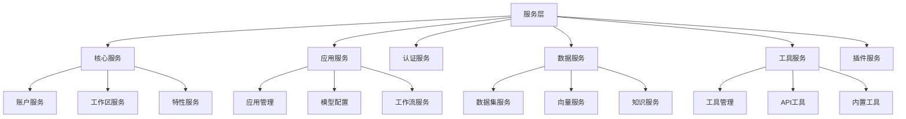

# Services 服务层设计文档

## 整体架构



## 服务模块说明

### 1. 核心服务

#### account_service.py
- **功能**: 用户账户管理
- **实现**:
```python
class AccountService:
    """账户服务"""
    
    @staticmethod
    def create_account(email: str, password: str, name: str) -> Account:
        """创建账户"""
        account = Account(
            email=email,
            name=name,
            password=hash_password(password)
        )
        db.session.add(account)
        db.session.commit()
        return account
    
    @staticmethod
    def authenticate(email: str, password: str) -> Optional[Account]:
        """认证账户"""
        account = Account.query.filter_by(email=email).first()
        if account and account.verify_password(password):
            return account
        return None
```

#### workspace_service.py
- **功能**: 工作区管理
```python
class WorkspaceService:
    """工作区服务"""
    
    def create_workspace(self, name: str, owner_id: str) -> Workspace:
        """创建工作区"""
        workspace = Workspace(
            name=name,
            owner_id=owner_id
        )
        db.session.add(workspace)
        db.session.commit()
        return workspace
```

### 2. 应用服务

#### app_service.py
- **功能**: 应用管理服务
```python
class AppService:
    """应用服务"""
    
    async def create_app(self, data: dict) -> App:
        """创建应用"""
        app = App(**data)
        await self._initialize_app(app)
        return app
    
    async def _initialize_app(self, app: App):
        """初始化应用"""
        await self._setup_model_config(app)
        await self._create_indexes(app)
```

#### workflow_service.py
- **功能**: 工作流服务
```python
class WorkflowService:
    """工作流服务"""
    
    async def execute_workflow(self, workflow_id: str, inputs: dict):
        """执行工作流"""
        workflow = await self._get_workflow(workflow_id)
        engine = WorkflowEngine(workflow)
        return await engine.run(inputs)
```

### 3. 数据服务

#### dataset_service.py
- **功能**: 数据集服务
```python
class DatasetService:
    """数据集服务"""
    
    async def import_documents(self, dataset_id: str, files: List[File]):
        """导入文档"""
        dataset = await self._get_dataset(dataset_id)
        for file in files:
            await self._process_file(dataset, file)
```

#### vector_service.py
- **功能**: 向量服务
```python
class VectorService:
    """向量服务"""
    
    async def create_embeddings(self, texts: List[str]) -> List[List[float]]:
        """创建向量嵌入"""
        embeddings = await self.model.embed_texts(texts)
        return embeddings
```

### 4. 工具服务

#### tools_manage_service.py
- **功能**: 工具管理服务
```python
class ToolsManageService:
    """工具管理服务"""
    
    def register_tool(self, tool_config: dict):
        """注册工具"""
        tool = self._create_tool(tool_config)
        self.tool_registry.register(tool)
        return tool
```

## 服务间通信

### 1. 事件机制
```python
class EventEmitter:
    """事件发射器"""
    
    def emit(self, event_name: str, data: dict):
        """发送事件"""
        for handler in self._handlers.get(event_name, []):
            handler(data)
```

### 2. 任务队列
```python
class TaskQueue:
    """任务队列"""
    
    async def enqueue(self, task: Task):
        """入队任务"""
        await self.queue.put(task)
        return task.id
```

## 错误处理

### 1. 业务异常
```python
class ServiceError(Exception):
    """服务错误基类"""
    def __init__(self, message: str, code: int = 400):
        self.message = message
        self.code = code
```

### 2. 错误响应
```python
def handle_service_error(error: ServiceError):
    """处理服务错误"""
    return {
        'code': error.code,
        'message': error.message
    }, error.code
```

## 缓存策略

### 1. 数据缓存
```python
class CacheService:
    """缓存服务"""
    
    async def get_or_set(self, key: str, getter: Callable):
        """获取或设置缓存"""
        value = await self.redis.get(key)
        if value is None:
            value = await getter()
            await self.redis.set(key, value)
        return value
```

### 2. 查询缓存
```python
class QueryCache:
    """查询缓存"""
    
    def cache_query(self, func):
        """缓存查询结果"""
        @wraps(func)
        async def wrapper(*args, **kwargs):
            cache_key = self._get_cache_key(func, args, kwargs)
            return await self.cache_service.get_or_set(
                cache_key,
                lambda: func(*args, **kwargs)
            )
        return wrapper
```

## 性能优化

### 1. 并发处理
```python
class ConcurrentService:
    """并发服务"""
    
    async def parallel_process(self, items: List[Any], processor: Callable):
        """并行处理"""
        tasks = [processor(item) for item in items]
        return await asyncio.gather(*tasks)
```

### 2. 批量操作
```python
class BatchService:
    """批量服务"""
    
    async def batch_insert(self, items: List[dict]):
        """批量插入"""
        chunks = self._chunk_items(items)
        for chunk in chunks:
            await self._insert_chunk(chunk)
```

## 监控和日志

### 1. 性能监控
```python
class ServiceMonitor:
    """服务监控"""
    
    def monitor(self, func):
        """监控方法执行"""
        @wraps(func)
        async def wrapper(*args, **kwargs):
            start = time.time()
            result = await func(*args, **kwargs)
            duration = time.time() - start
            self._record_metrics(func.__name__, duration)
            return result
        return wrapper
```

### 2. 日志记录
```python
class ServiceLogger:
    """服务日志"""
    
    def log_operation(self, operation: str, data: dict):
        """记录操作"""
        self.logger.info(
            f"Operation: {operation}",
            extra={
                'data': data,
                'timestamp': datetime.utcnow()
            }
        )
```

## 最佳实践

### 1. 服务设计
- 职责单一
- 接口清晰
- 依赖注入
- 错误处理

### 2. 性能优化
- 缓存策略
- 并发处理
- 批量操作
- 资源管理

### 3. 可维护性
- 代码组织
- 错误处理
- 日志记录
- 监控指标

### 4. 测试策略
- 单元测试
- 集成测试
- 性能测试
- 压力测试
