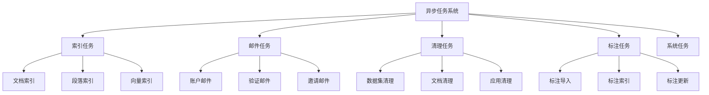

# Tasks 异步任务设计文档

## 整体架构



## 任务分类说明

### 1. 索引任务
- **功能**: 处理文档和向量索引相关操作
- **主要任务**:
```python
@celery.task
def document_indexing_task(document_id: str):
    """文档索引任务"""
    try:
        # 获取文档
        document = Document.query.get(document_id)
        if not document:
            raise ValueError(f"Document {document_id} not found")
            
        # 处理文档
        processor = DocumentProcessor(document)
        processor.process()
        
        # 创建索引
        indexer = DocumentIndexer(document)
        indexer.create_index()
        
    except Exception as e:
        logger.error(f"Indexing failed for document {document_id}: {str(e)}")
        raise
```

### 2. 邮件任务
- **功能**: 处理系统邮件发送
```python
@celery.task
def mail_reset_password_task(email: str, reset_token: str):
    """发送密码重置邮件"""
    try:
        template = MailTemplate.get_template('reset_password')
        content = template.render(
            reset_token=reset_token,
            expire_time=30  # minutes
        )
        
        mailer = MailSender()
        mailer.send(
            to=email,
            subject="重置密码",
            content=content
        )
    except Exception as e:
        logger.error(f"Failed to send reset password email: {str(e)}")
        raise
```

### 3. 清理任务
- **功能**: 处理数据清理和删除
```python
@celery.task
def clean_dataset_task(dataset_id: str):
    """数据集清理任务"""
    try:
        # 删除文档
        Document.query.filter_by(dataset_id=dataset_id).delete()
        
        # 删除向量索引
        vector_store = VectorStore()
        vector_store.delete_collection(dataset_id)
        
        # 删除数据集
        Dataset.query.filter_by(id=dataset_id).delete()
        db.session.commit()
        
    except Exception as e:
        db.session.rollback()
        logger.error(f"Failed to clean dataset {dataset_id}: {str(e)}")
        raise
```

### 4. 标注任务
- **功能**: 处理标注数据操作
```python
@celery.task
def batch_import_annotations_task(annotations: List[dict]):
    """批量导入标注任务"""
    try:
        for annotation in annotations:
            # 创建标注
            anno = Annotation(**annotation)
            db.session.add(anno)
            
            # 创建向量索引
            indexer = AnnotationIndexer(anno)
            indexer.create_index()
            
        db.session.commit()
    except Exception as e:
        db.session.rollback()
        logger.error(f"Failed to import annotations: {str(e)}")
        raise
```

## 任务配置

### 1. Celery 配置
```python
CELERY_CONFIG = {
    'broker_url': 'redis://localhost:6379/0',
    'result_backend': 'redis://localhost:6379/0',
    'task_serializer': 'json',
    'result_serializer': 'json',
    'accept_content': ['json'],
    'timezone': 'UTC',
    'enable_utc': True,
    
    # 任务队列配置
    'task_queues': {
        'indexing': {
            'exchange': 'indexing',
            'routing_key': 'indexing.#'
        },
        'mail': {
            'exchange': 'mail',
            'routing_key': 'mail.#'
        },
        'cleaning': {
            'exchange': 'cleaning',
            'routing_key': 'cleaning.#'
        }
    }
}
```

### 2. 任务路由
```python
TASK_ROUTES = {
    # 索引任务
    'tasks.document_indexing_task': {'queue': 'indexing'},
    'tasks.segment_indexing_task': {'queue': 'indexing'},
    
    # 邮件任务
    'tasks.mail_reset_password_task': {'queue': 'mail'},
    'tasks.mail_invite_member_task': {'queue': 'mail'},
    
    # 清理任务
    'tasks.clean_dataset_task': {'queue': 'cleaning'},
    'tasks.clean_document_task': {'queue': 'cleaning'}
}
```

## 错误处理

### 1. 任务重试
```python
@celery.task(
    bind=True,
    max_retries=3,
    retry_backoff=True
)
def retry_document_indexing_task(self, document_id: str):
    """文档索引重试任务"""
    try:
        # 执行索引
        process_document(document_id)
    except Exception as e:
        # 重试任务
        raise self.retry(exc=e)
```

### 2. 错误通知
```python
def handle_task_failure(task_id: str, exc: Exception):
    """处理任务失败"""
    # 记录错误
    logger.error(f"Task {task_id} failed: {str(exc)}")
    
    # 发送通知
    notification = TaskFailureNotification(task_id, exc)
    notification.send()
```

## 监控和日志

### 1. 任务监控
```python
@task_postrun.connect
def task_postrun_handler(task_id, task, *args, **kwargs):
    """任务执行后处理"""
    # 记录执行时间
    duration = time.time() - task.start_time
    
    # 更新指标
    metrics.record_task_duration(task.name, duration)
    
    # 记录状态
    TaskStatus.update(task_id, 'completed')
```

### 2. 性能指标
```python
class TaskMetrics:
    """任务指标收集"""
    
    def record_task_duration(self, task_name: str, duration: float):
        """记录任务执行时间"""
        self.histogram(
            'task_duration_seconds',
            duration,
            tags={'task_name': task_name}
        )
```

## 设计原则

### 1. 任务定义
- 原子性操作
- 幂等性设计
- 超时控制
- 资源限制

### 2. 错误处理
- 优雅降级
- 任务重试
- 死信队列
- 错误通知

### 3. 性能优化
- 批量处理
- 并发控制
- 资源池化
- 任务优先级

### 4. 可靠性保证
- 消息确认
- 事务支持
- 状态追踪
- 失败恢复

## 最佳实践

### 1. 任务开发
1. 定义任务接口
2. 实现业务逻辑
3. 添加错误处理
4. 配置任务路由

### 2. 监控和维护
1. 设置监控指标
2. 配置日志记录
3. 实现错误通知
4. 性能优化

### 3. 部署和扩展
1. 队列分离
2. 资源配置
3. 监控告警
4. 扩容策略

## 注意事项

### 1. 任务设计
- 避免长时间任务
- 合理设置超时
- 保证幂等性
- 处理边界情况

### 2. 资源管理
- 控制并发数
- 监控资源使用
- 设置资源限制
- 避免资源泄露

### 3. 性能考虑
- 合理分配队列
- 优化任务粒度
- 控制重试策略
- 缓存结果

### 4. 运维支持
- 日志完备性
- 监控覆盖
- 告警及时
- 容灾备份
