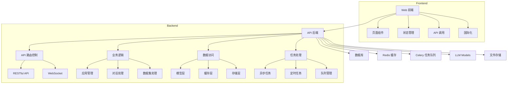

# Dify LLM 应用开发平台架构文档

## 整体架构

Dify 是一个 LLM 应用开发平台，采用前后端分离的微服务架构设计：

### 前端架构 (web/)
- **框架**: Next.js
- **语言**: TypeScript
- **样式**: Tailwind CSS
- **特性**:
  - 组件化开发
  - 状态管理
  - 国际化支持
  - 路由系统

### 后端架构 (api/)
- **核心框架**: 
  - Flask (Web框架)
  - Celery (任务队列)
  - SQLAlchemy (ORM)
  - Redis (缓存/消息)
  
- **主要模块**:
  - configs/: 配置管理
  - core/: 核心业务逻辑
  - controllers/: API控制器
  - models/: 数据模型
  - services/: 业务服务
  - tasks/: 异步任务

- **特性支持**:
  - RESTful API
  - WebSocket
  - 异步任务处理
  - 数据持久化
  - 文件存储

## 系统架构图

### 整体系统架构

### 后端代码结构

```mermaid
graph TD
    API[后端架构] --> Configs[configs/配置管理]
    API --> Core[core/核心模块]
    API --> Controllers[controllers/控制器]
    API --> Models[models/数据模型]
    API --> Services[services/服务层]
    API --> Tasks[tasks/任务处理]
    API --> Extensions[extensions/扩展模块]
    API --> Events[events/事件系统]
    
    Configs --> CF1[app_config]
    Configs --> CF2[feature_flags]
    Configs --> CF3[model_config]
    
    Core --> CR1[LLM集成]
    Core --> CR2[向量存储]
    Core --> CR3[文本处理]
    Core --> CR4[插件系统]
    
    Controllers --> CT1[API路由]
    Controllers --> CT2[请求处理]
    Controllers --> CT3[响应封装]
    
    Models --> MD1[数据定义]
    Models --> MD2[关系映射]
    Models --> MD3[查询构建]
    
    Services --> SV1[业务逻辑]
    Services --> SV2[数据处理]
    Services --> SV3[第三方集成]
    
    Tasks --> TK1[异步任务]
    Tasks --> TK2[调度系统]
    Tasks --> TK3[并发控制]
    
    Extensions --> EX1[数据库]
    Extensions --> EX2[缓存]
    Extensions --> EX3[消息队列]
    
    Events --> EV1[事件定义]
    Events --> EV2[事件处理]
    Events --> EV3[消息分发]
```

## 关键模块

### 前端核心模块
1. **页面组件 (app/)**
   - 实现界面交互
   - 管理组件状态
   - 处理用户事件

2. **状态管理**
   - 使用 Context
   - Hooks 封装业务逻辑

3. **API 服务层**
   - 封装 API 请求
   - 处理数据转换
   - 错误处理

4. **国际化支持**
   - 多语言配置
   - 文案管理

### 后端核心模块

1. **API 路由层**
   - RESTful 接口定义
   - 请求参数验证
   - 响应封装

2. **业务逻辑层** 
   - 实现核心功能
   - 处理业务规则
   - 调用外部服务

3. **数据访问层**
   - 数据库操作
   - 缓存处理
   - 文件存储

4. **任务处理**
   - 异步任务
   - 定时任务
   - 消息队列

## 技术特点

1. 前端技术栈
   - Next.js - React 框架
   - TypeScript - 类型系统
   - Tailwind - 样式方案
   - i18n - 国际化
   
2. 后端技术栈
   - Flask - Web 框架
   - SQLAlchemy - ORM 框架
   - Celery - 任务队列
   - Redis - 缓存存储

3. 部署方案
   - Docker 容器化
   - Nginx 反向代理
   - Redis 缓存
   - PostgreSQL 数据库

## 设计理念

1. **模块化设计**
   - 高内聚低耦合
   - 清晰的模块边界
   - 可扩展的架构

2. **前后端分离** 
   - 独立部署
   - 接口规范
   - 数据流转清晰

3. **可扩展性**
   - 插件化架构
   - 服务化设计
   - 灵活配置

4. **开发友好**
   - 完善的文档
   - 统一的编码规范
   - 自动化工具支持
