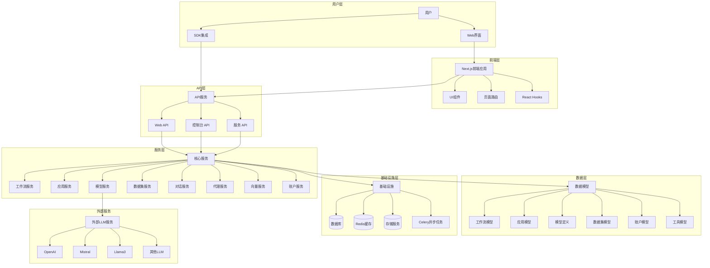

# Dify 项目架构与技术文档

## 项目概述

Dify 是一个开源的 LLM（大型语言模型）应用开发平台。它提供了直观的界面，结合了代理 AI 工作流、RAG（检索增强生成）管道、代理能力、模型管理、可观察性功能等，让用户能够快速从原型转向生产。

## 系统架构

Dify 采用前后端分离的架构设计，主要由以下几个部分组成：



### 核心组件

1. **前端应用（web）**：

   - 基于 Next.js 框架的 React 应用
   - 包含工作流、聊天、聊天机器人、补全等功能模块
   - 提供直观的用户界面，用于创建和管理 AI 应用
2. **后端服务（api）**：

   - 基于 Flask 的 Python 应用
   - 提供 Web API、控制台 API 和服务 API
   - 实现核心业务逻辑和功能
3. **SDK（sdks）**：

   - 提供多种语言的客户端 SDK（Python、Node.js、PHP）
   - 方便开发者在不同编程语言环境中集成 Dify 功能
4. **Docker 部署**：

   - 提供 Docker 配置，便于快速部署和运行

## 技术原理

### 1. 工作流（Workflow）

Dify 的工作流功能允许用户在可视化画布上构建和测试强大的 AI 工作流。工作流服务（workflow_service.py）负责工作流的创建、管理和执行，工作流模型（workflow.py）定义了工作流的数据结构。

### 2. 模型支持

Dify 支持与数百个专有/开源 LLM 无缝集成，包括 GPT、Mistral、Llama3 和任何兼容 OpenAI API 的模型。模型提供商服务（model_provider_service.py）和模型负载均衡服务（model_load_balancing_service.py）负责模型的管理和调用。

### 3. Prompt IDE

Dify 提供了直观的界面，用于制作提示、比较模型性能，并向基于聊天的应用添加文本转语音等附加功能。

### 4. RAG 管道

Dify 具有广泛的 RAG（检索增强生成）功能，涵盖从文档摄取到检索的所有内容，并支持从 PDF、PPT 和其他常见文档格式中提取文本。数据集服务（dataset_service.py）和向量服务（vector_service.py）是实现 RAG 功能的核心组件。

### 5. 代理能力

Dify 允许用户基于 LLM 函数调用或 ReAct 定义代理，并为代理添加预构建或自定义工具。代理服务（agent_service.py）负责代理的创建和管理。

### 6. LLMOps

Dify 提供了监控和分析应用程序日志和性能的功能，用户可以根据生产数据和注释持续改进提示、数据集和模型。

### 7. 后端即服务

Dify 的所有功能都提供了相应的 API，用户可以轻松地将 Dify 集成到自己的业务逻辑中。

## 使用方法

### 快速开始

最简单的启动 Dify 服务器的方法是通过 Docker Compose。确保您的机器上安装了 Docker 和 Docker Compose，然后运行以下命令：

```bash
cd dify
cd docker
cp .env.example .env
docker compose up -d
```

运行后，您可以在浏览器中访问 Dify 仪表板：http://localhost/install，并开始初始化过程。

### 使用 Dify

- **云服务**：Dify 提供了 [Dify Cloud](https://dify.ai) 服务，无需设置即可试用。它提供了与自部署版本相同的所有功能，并在沙盒计划中包含 200 次免费的 GPT-4 调用。
- **自托管社区版**：按照[快速开始](#快速开始)指南在您的环境中快速运行 Dify。使用[文档](https://docs.dify.ai)获取更多参考和更深入的说明。
- **企业版 Dify**：Dify 提供了额外的企业级功能。您可以通过[聊天机器人](https://udify.app/chat/22L1zSxg6yW1cWQg)或[电子邮件](mailto:business@dify.ai?subject=[GitHub]Business%20License%20Inquiry)联系他们讨论企业需求。

## 当前不足与新的实现方式

### 当前不足

1. **资源消耗**：

   - 运行完整的 Dify 平台需要相当的计算资源，特别是在处理大量数据和复杂工作流时。
   - 最低系统要求为 2 核 CPU 和 4GB RAM，但实际生产环境可能需要更多资源。
2. **部署复杂性**：

   - 虽然提供了 Docker Compose 配置，但完整部署和配置仍然需要一定的技术知识。
   - 高可用性设置需要额外的配置和资源。
3. **模型依赖**：

   - 虽然支持多种模型，但许多高级功能仍然依赖于商业 LLM 服务，如 OpenAI 的 GPT 模型。
   - 使用开源模型可能面临性能和功能限制。
4. **学习曲线**：

   - 平台功能丰富，但对于新用户来说可能存在学习曲线。
   - 工作流和 RAG 管道的高级配置需要一定的专业知识。

### 新的实现方式

1. **轻量级部署选项**：

   - 现代云原生部署方案，如 Kubernetes Helm Charts 和 Terraform 配置，使部署更加灵活和可扩展。
   - 社区贡献的部署方案，如 AWS CDK 和 Azure Terraform，简化了云平台部署。
2. **改进的模型支持**：

   - 增强对本地部署开源模型的支持，减少对商业 API 的依赖。
   - 模型负载均衡和缓存机制，提高性能并降低成本。
3. **可视化工作流编辑器**：

   - 直观的可视化界面，使非技术用户也能创建复杂的 AI 工作流。
   - 预构建的工作流模板，加速应用开发。
4. **增强的 RAG 功能**：

   - 改进的文档处理和知识提取能力。
   - 更智能的检索算法和上下文管理。
5. **企业级功能**：

   - SSO（单点登录）和访问控制功能，满足企业安全需求。
   - 更全面的监控和分析工具，用于性能优化和问题排查。
6. **社区驱动的发展**：

   - 活跃的开源社区，持续贡献改进和新功能。
   - 多语言支持和国际化，使平台更加全球化。

## 结论

Dify 是一个功能强大的 LLM 应用开发平台，提供了从原型到生产的完整解决方案。它的架构设计清晰，功能模块化，支持多种部署方式，适合不同规模的组织和项目。虽然存在一些不足，但随着社区的发展和技术的进步，Dify 正在不断改进和完善，为 AI 应用开发提供更好的支持。

对于希望快速构建和部署 AI 应用的开发者和组织，Dify 提供了一个理想的平台，结合了易用性和强大功能，使 AI 应用开发变得更加简单和高效。
