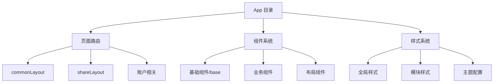

# App 目录结构说明

## 整体架构



## 目录结构设计

### 1. 路由系统 (Next.js App Router)
- **(commonLayout)/** - 通用布局路由
  - `apps/` - 应用列表页面
  - `datasets/` - 数据集页面
  - `explore/` - 探索页面
  - `plugins/` - 插件页面
  - `tools/` - 工具页面

- **(shareLayout)/** - 分享布局路由
  - `chat/` - 聊天功能
  - `chatbot/` - 聊天机器人
  - `completion/` - 补全功能
  - `workflow/` - 工作流程

- **账户相关路由**
  - `account/` - 账户管理
  - `signin/` - 登录
  - `activate/` - 激活
  - `forgot-password/` - 密码找回

### 2. 组件系统

#### 基础组件 (components/base/)
- `button/` - 按钮组件
- `input/` - 输入框组件
- `dialog/` - 对话框组件
- `dropdown/` - 下拉菜单
- `icons/` - 图标系统
- 其他基础 UI 组件

#### 业务组件 (components/)
- `app/` - 应用相关组件
- `datasets/` - 数据集组件
- `explore/` - 探索功能组件
- `plugins/` - 插件相关组件
- `workflow/` - 工作流组件

#### 布局组件
- `layout.tsx` - 全局布局
- `app-sidebar/` - 侧边栏组件
- `header/` - 头部组件

### 3. 样式系统
- `styles/` - 全局样式
  - `globals.css` - 全局样式定义
  - `markdown.scss` - Markdown 样式
  - `preflight.css` - 样式预设置

## 核心设计原则

### 1. 组件化设计
- 采用原子设计理念
- 组件高度可复用
- 职责单一明确

### 2. 路由组织
- 基于 Next.js App Router
- 按功能模块划分
- 清晰的层级结构

### 3. 状态管理
- 使用 React Context
- 结合 Hooks 管理状态
- 合理的状态分层

### 4. 样式方案
- 使用 CSS Modules
- Tailwind CSS 工具类
- 主题样式统一

## 技术实现特点

### 1. 组件封装
```typescript
// 基础组件示例
interface ButtonProps {
  variant: 'primary' | 'secondary'
  size: 'sm' | 'md' | 'lg'
  children: React.ReactNode
}

const Button = ({ variant, size, children }: ButtonProps) => {
  // 组件实现
}
```

### 2. 布局系统
```typescript
// 布局组件示例
const RootLayout = ({ children }: { children: React.ReactNode }) => {
  return (
    <html>
      <body>
        <Header />
        <Sidebar />
        <main>{children}</main>
      </body>
    </html>
  )
}
```

### 3. 路由处理
```typescript
// 页面组件示例
const AppsPage = () => {
  return (
    <div>
      <AppsList />
      <NewAppButton />
    </div>
  )
}
```

## 开发指南

### 1. 新增页面
1. 在对应路由目录下创建 page.tsx
2. 实现页面组件
3. 添加相关样式文件

### 2. 开发组件
1. 在适当目录创建组件文件
2. 编写组件代码和样式
3. 编写组件文档和测试

### 3. 样式开发
1. 优先使用 Tailwind CSS
2. 特殊样式使用 CSS Modules
3. 遵循设计规范

## 最佳实践

1. **组件开发**
   - 保持组件纯函数
   - 合理使用 Props 和 State
   - 编写清晰的类型定义

2. **性能优化**
   - 合理使用 React.memo
   - 避免不必要的渲染
   - 懒加载组件和路由

3. **代码规范**
   - 遵循 TypeScript 规范
   - 使用 ESLint 和 Prettier
   - 编写清晰的注释
