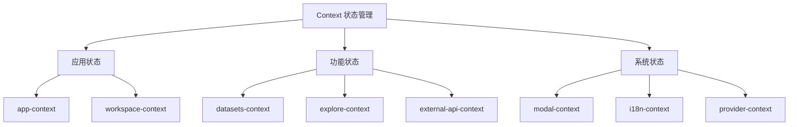

# Context 状态管理设计文档

## 整体架构



## 状态管理设计

### 1. 应用核心状态
- **app-context.tsx**
  - 管理应用全局状态
  - 处理应用配置信息
  - 控制应用生命周期

- **workspace-context.tsx**
  - 工作区状态管理
  - 多工作区切换
  - 工作区配置

### 2. 功能模块状态
- **datasets-context.tsx & dataset-detail.ts**
  - 数据集状态管理
  - 数据集操作接口
  - 数据集详情控制

- **explore-context.ts**
  - 探索功能状态
  - 搜索条件管理
  - 结果展示控制

- **external-api-panel-context.tsx & external-knowledge-api-context.tsx**
  - 外部 API 集成
  - API 面板状态
  - 知识库 API 管理

### 3. 系统功能状态
- **modal-context.tsx**
  - 模态框状态管理
  - 弹窗层级控制
  - 弹窗动画管理

- **i18n.ts**
  - 国际化状态
  - 语言切换
  - 文案管理

- **provider-context.tsx**
  - 服务提供者状态
  - provider 配置
  - 服务状态管理

### 4. 调试与事件
- **debug-configuration.ts**
  - 调试配置管理
  - 开发环境设置

- **event-emitter.tsx**
  - 事件总线
  - 跨组件通信
  - 事件订阅发布

## 实现原理

### 1. Context 创建模式
```typescript
// 典型的 Context 创建模式
interface AppContextType {
  state: AppState
  dispatch: React.Dispatch<AppAction>
}

const AppContext = createContext<AppContextType | undefined>(undefined)

export const AppProvider: React.FC<{ children: React.ReactNode }> = ({ children }) => {
  const [state, dispatch] = useReducer(appReducer, initialState)
  
  return (
    <AppContext.Provider value={{ state, dispatch }}>
      {children}
    </AppContext.Provider>
  )
}
```

### 2. 状态更新机制
```typescript
// 使用 Reducer 进行状态更新
type AppAction = 
  | { type: 'UPDATE_CONFIG'; payload: Config }
  | { type: 'SET_THEME'; payload: Theme }

function appReducer(state: AppState, action: AppAction): AppState {
  switch (action.type) {
    case 'UPDATE_CONFIG':
      return { ...state, config: action.payload }
    case 'SET_THEME':
      return { ...state, theme: action.payload }
    default:
      return state
  }
}
```

### 3. 状态订阅模式
```typescript
// 状态订阅钩子
export function useApp() {
  const context = useContext(AppContext)
  if (!context) {
    throw new Error('useApp must be used within AppProvider')
  }
  return context
}
```

## 优势与特点

### 1. 状态隔离
- 不同模块状态独立管理
- 避免状态污染
- 方便维护和调试

### 2. 性能优化
- 精确更新
- 避免不必要渲染
- 合理的状态粒度

### 3. 类型安全
- TypeScript 支持
- 完整的类型定义
- 编译时错误检查

### 4. 可扩展性
- 易于添加新的 Context
- 支持状态组合
- 灵活的状态访问

## 最佳实践

### 1. Context 创建
- 明确状态边界
- 合理的状态粒度
- 提供默认值

### 2. 状态更新
- 使用 action 描述更新
- 保持更新操作纯函数
- 避免频繁更新

### 3. 性能考虑
- 使用 useMemo 缓存值
- 合理拆分 Context
- 避免重复渲染

## 使用指南

### 1. 创建新的 Context
1. 定义状态接口
2. 创建 Context 实例
3. 实现 Provider 组件
4. 编写使用钩子

### 2. 状态访问
1. 使用专用 Hook
2. 确保在 Provider 内使用
3. 处理异常情况

### 3. 调试方法
1. 使用 React DevTools
2. 检查状态变化
3. 监控性能问题
