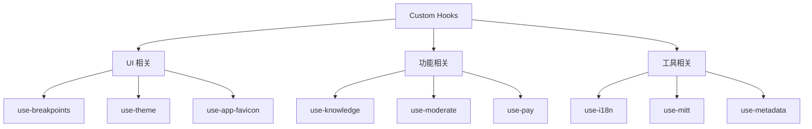

# Hooks 自定义钩子设计文档

## 整体架构



## Hooks 分类及用途

### 1. UI 相关 Hooks

#### use-breakpoints.ts
- 响应式断点管理
- 屏幕尺寸检测
- 布局适配控制

#### use-theme.ts
- 主题状态管理
- 主题切换功能
- 主题配置获取

#### use-app-favicon.ts
- 应用图标管理
- 动态图标更新
- 图标状态控制

### 2. 功能相关 Hooks

#### use-knowledge.ts
- 知识库相关功能
- 数据获取和缓存
- 知识状态管理

#### use-moderate.ts
- 内容审核功能
- 审核规则管理
- 审核状态控制

#### use-pay.tsx
- 支付功能封装
- 支付状态管理
- 支付流程控制

### 3. 工具类 Hooks

#### use-i18n.ts
- 国际化功能
- 语言切换
- 文案获取

#### use-mitt.ts
- 事件总线封装
- 事件订阅发布
- 组件通信

#### use-metadata.ts
- 元数据管理
- 配置信息获取
- 系统信息管理

#### use-timestamp.ts
- 时间戳处理
- 时间格式化
- 时间计算

#### use-tab-searchparams.ts
- URL 参数管理
- 标签页状态
- 路由参数处理

## 实现示例

### 1. 响应式 Hook
```typescript
// use-breakpoints.ts
export function useBreakpoints() {
  const [breakpoint, setBreakpoint] = useState<Breakpoint>('md')

  useEffect(() => {
    const handleResize = () => {
      const width = window.innerWidth
      if (width < 640) setBreakpoint('sm')
      else if (width < 1024) setBreakpoint('md')
      else setBreakpoint('lg')
    }

    window.addEventListener('resize', handleResize)
    handleResize()

    return () => window.removeEventListener('resize', handleResize)
  }, [])

  return breakpoint
}
```

### 2. 主题 Hook
```typescript
// use-theme.ts
export function useTheme() {
  const [theme, setTheme] = useState<'light' | 'dark'>('light')

  const toggleTheme = useCallback(() => {
    setTheme(prev => prev === 'light' ? 'dark' : 'light')
  }, [])

  useEffect(() => {
    document.documentElement.setAttribute('data-theme', theme)
  }, [theme])

  return { theme, toggleTheme }
}
```

### 3. 国际化 Hook
```typescript
// use-i18n.ts
export function useI18n() {
  const { locale, messages } = useContext(I18nContext)

  const t = useCallback((key: string, params?: Record<string, string>) => {
    let message = messages[key] || key
    if (params) {
      Object.entries(params).forEach(([key, value]) => {
        message = message.replace(`{${key}}`, value)
      })
    }
    return message
  }, [messages])

  return { locale, t }
}
```

## 设计原则

### 1. 职责单一
- 每个 Hook 专注于单一功能
- 避免功能混杂
- 便于维护和测试

### 2. 可复用性
- 提取通用逻辑
- 支持参数配置
- 接口设计合理

### 3. 性能优化
- 合理使用依赖数组
- 避免重复计算
- 缓存频繁变化的值

### 4. 类型安全
- TypeScript 类型定义
- 参数类型检查
- 返回值类型推导

## 使用指南

### 1. Hook 使用规范
```typescript
// 正确的使用方式
function MyComponent() {
  const { theme } = useTheme()
  const breakpoint = useBreakpoints()
  const { t } = useI18n()

  return (
    <div className={theme}>
      <h1>{t('title')}</h1>
      {breakpoint === 'sm' && <MobileView />}
    </div>
  )
}
```

### 2. 注意事项
- 遵循 React Hooks 规则
- 只在组件顶层调用
- 不在条件语句中使用

### 3. 错误处理
```typescript
// 错误处理示例
function useSafeAsync<T>(asyncFn: () => Promise<T>) {
  const [error, setError] = useState<Error | null>(null)
  const [data, setData] = useState<T | null>(null)

  useEffect(() => {
    asyncFn()
      .then(setData)
      .catch(setError)
  }, [asyncFn])

  return { data, error }
}
```

## 最佳实践

### 1. 状态管理
- 合理使用 useState
- 适时使用 useReducer
- 注意状态更新时机

### 2. 副作用处理
- 清理副作用
- 控制执行时机
- 避免无限循环

### 3. 性能优化
- 使用 useMemo
- 使用 useCallback
- 避免不必要的重渲染

### 4. 测试建议
- 编写单元测试
- 测试边界情况
- 模拟异步操作
