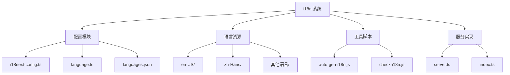

# 国际化（i18n）设计文档

## 整体架构



## 目录结构说明

### 1. 核心配置文件
- **i18next-config.ts**: i18next 配置
- **language.ts**: 语言相关配置
- **languages.json**: 支持的语言列表
- **server.ts**: 服务端国际化处理
- **index.ts**: 客户端入口

### 2. 语言资源目录
每种语言包含以下模块的翻译：
- app 相关翻译
- 数据集相关翻译
- 公共组件翻译
- 功能模块翻译

### 3. 工具脚本
- **auto-gen-i18n.js**: 自动生成翻译文件
- **check-i18n.js**: 检查翻译完整性

## 实现原理

### 1. 配置系统
```typescript
// i18next-config.ts
import i18next from 'i18next'

export const i18nextConfig = {
  defaultNS: 'common',
  fallbackLng: 'en-US',
  supportedLngs: ['en-US', 'zh-Hans', 'ja-JP'],
  
  resources: {
    'en-US': {
      common: require('./en-US/common'),
      app: require('./en-US/app'),
      // ...其他模块
    },
    // ...其他语言
  }
}
```

### 2. 语言切换
```typescript
// language.ts
export const languageOptions = [
  { label: 'English', value: 'en-US' },
  { label: '简体中文', value: 'zh-Hans' },
  { label: '日本語', value: 'ja-JP' },
  // ...其他语言
]

export function changeLanguage(lng: string) {
  i18next.changeLanguage(lng)
}
```

### 3. 服务端实现
```typescript
// server.ts
import { createI18nServer } from 'next-i18next/server'

export default createI18nServer({
  detection: {
    order: ['cookie', 'header'],
    caches: ['cookie'],
  },
  // ...其他配置
})
```

## 翻译管理

### 1. 翻译文件结构
```typescript
// en-US/common.ts 示例
export default {
  'common.ok': 'OK',
  'common.cancel': 'Cancel',
  'common.confirm': 'Confirm',
  'common.delete': 'Delete',
  // ...其他翻译
}
```

### 2. 模块化组织
- 按功能模块拆分
- 统一的命名空间
- 层级化的键名

### 3. 翻译检查
```javascript
// check-i18n.js
function checkTranslations() {
  const baseTranslations = loadTranslations('en-US')
  const languages = ['zh-Hans', 'ja-JP', /* ... */]
  
  languages.forEach(lang => {
    const langTranslations = loadTranslations(lang)
    checkMissingKeys(baseTranslations, langTranslations)
  })
}
```

## 使用方式

### 1. 组件中使用
```typescript
import { useTranslation } from 'react-i18next'

function MyComponent() {
  const { t } = useTranslation()
  
  return (
    <div>
      <h1>{t('common.title')}</h1>
      <p>{t('common.description')}</p>
    </div>
  )
}
```

### 2. 服务端渲染
```typescript
// pages/index.tsx
export async function getStaticProps({ locale }) {
  return {
    props: {
      ...(await serverSideTranslations(locale)),
    },
  }
}
```

### 3. 动态内容
```typescript
// 带变量的翻译
t('welcome', { name: username })

// 复数形式
t('items', { count: 4 })
```

## 开发指南

### 1. 添加新语言
1. 在 languages.json 中添加语言配置
2. 创建语言资源目录
3. 实现所有必需的翻译文件
4. 更新语言选择器

### 2. 添加新翻译
1. 在基础语言(en-US)中添加键值
2. 运行翻译检查脚本
3. 补充其他语言的翻译
4. 验证翻译完整性

### 3. 翻译规范
- 使用有意义的键名
- 保持翻译一致性
- 避免硬编码文本
- 使用变量进行动态内容

## 工具支持

### 1. 自动生成工具
```javascript
// auto-gen-i18n.js
async function generateTranslations() {
  const baseContent = loadBaseTranslations()
  const targetLanguages = ['zh-Hans', 'ja-JP']
  
  for (const lang of targetLanguages) {
    await generateLanguageFiles(baseContent, lang)
  }
}
```

### 2. 检查工具
- 检查缺失的翻译
- 验证翻译格式
- 检查变量使用

### 3. IDE 支持
- 翻译提示
- 跳转定义
- 自动完成

## 最佳实践

### 1. 翻译管理
- 统一的翻译流程
- 定期同步翻译
- 版本控制管理

### 2. 性能优化
- 按需加载翻译
- 缓存已加载的翻译
- 优化打包大小

### 3. 质量保证
- 翻译审核机制
- 自动化测试
- 定期检查更新

## 贡献指南

### 1. 翻译贡献
1. Fork 项目
2. 添加或修改翻译
3. 运行检查脚本
4. 提交 PR

### 2. 文档维护
- 保持文档更新
- 添加使用示例
- 更新变更记录

### 3. 问题反馈
- 提交 issue
- 描述问题现象
- 提供复现步骤
