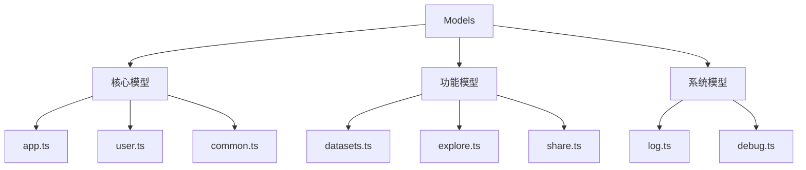

# Models 数据模型设计文档

## 整体架构



## 数据模型设计

### 1. 核心模型

#### app.ts
- 应用核心模型
- 应用配置定义
- 应用状态类型

```typescript
// 应用基础模型示例
interface App {
  id: string
  name: string
  type: AppType
  icon?: string
  description?: string
  created_at: string
  updated_at: string
  status: AppStatus
  config: AppConfig
}

// 应用配置类型
interface AppConfig {
  model: ModelConfig
  variables: VariableConfig[]
  features: FeatureConfig
}
```

#### user.ts
- 用户模型定义
- 权限相关类型
- 用户设置接口

```typescript
// 用户模型示例
interface User {
  id: string
  name: string
  email: string
  avatar?: string
  role: UserRole
  settings: UserSettings
  permissions: Permission[]
}
```

#### common.ts
- 通用类型定义
- 共享接口定义
- 基础数据类型

```typescript
// 通用类型示例
interface Pagination {
  current: number
  pageSize: number
  total: number
}

interface Response<T> {
  code: number
  data: T
  message?: string
}
```

### 2. 功能模型

#### datasets.ts
- 数据集模型
- 数据结构定义
- 操作接口类型

```typescript
// 数据集模型示例
interface Dataset {
  id: string
  name: string
  description: string
  type: DatasetType
  format: DataFormat
  size: number
  records: number
  status: DatasetStatus
  metadata: DatasetMetadata
}
```

#### explore.ts
- 探索功能模型
- 搜索参数类型
- 结果数据结构

```typescript
// 探索模型示例
interface ExploreQuery {
  keyword: string
  filters: Filter[]
  sort: SortOption
  page: number
}

interface ExploreResult<T> {
  items: T[]
  total: number
  facets: Facet[]
}
```

#### share.ts
- 分享功能模型
- 权限控制类型
- 分享设置接口

```typescript
// 分享模型示例
interface ShareConfig {
  id: string
  type: ShareType
  expires?: Date
  permissions: SharePermission[]
  settings: ShareSettings
}
```

### 3. 系统模型

#### log.ts
- 日志记录模型
- 操作追踪类型
- 系统日志接口

```typescript
// 日志模型示例
interface Log {
  id: string
  type: LogType
  level: LogLevel
  message: string
  metadata: LogMetadata
  timestamp: string
  source: string
}
```

#### debug.ts
- 调试信息模型
- 开发环境配置
- 调试工具类型

```typescript
// 调试模型示例
interface DebugConfig {
  enabled: boolean
  level: DebugLevel
  options: DebugOptions
  tools: DebugTool[]
}
```

## 设计原则

### 1. 类型安全
- TypeScript 严格模式
- 完整的类型定义
- 类型推导支持

### 2. 接口一致性
- 统一的命名规范
- 一致的接口设计
- 清晰的类型层级

### 3. 可扩展性
- 灵活的类型组合
- 支持类型扩展
- 预留扩展接口

### 4. 数据完整性
- 必要字段验证
- 可选字段处理
- 默认值设定

## 使用指南

### 1. 定义新模型
```typescript
// 创建新模型示例
interface NewFeature {
  // 基础信息
  id: string
  name: string
  
  // 功能特定字段
  config: FeatureConfig
  state: FeatureState
  
  // 元数据
  metadata: Record<string, unknown>
  created_at: string
  updated_at: string
}
```

### 2. 类型扩展
```typescript
// 扩展已有类型
interface ExtendedUser extends User {
  additional_info: UserAdditionalInfo
  preferences: UserPreferences
}
```

### 3. 类型组合
```typescript
// 组合多个类型
type ComplexType = BaseType & 
  OptionalFeatures & 
  Partial<AdvancedFeatures>
```

## 最佳实践

### 1. 模型定义
- 清晰的字段命名
- 合理的类型划分
- 完整的注释文档

### 2. 类型复用
- 提取共用类型
- 合理使用泛型
- 避免类型重复

### 3. 版本控制
- 模型版本管理
- 兼容性处理
- 迁移策略

### 4. 测试验证
- 类型测试用例
- 边界条件测试
- 类型推导验证
