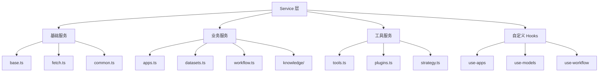

# Service 服务层设计文档

## 整体架构



## 服务层设计

### 1. 基础服务

#### base.ts & fetch.ts
- API 请求基础封装
- 请求拦截器
- 响应处理
- 错误统一处理

```typescript
// 基础请求封装示例
class BaseService {
  protected async request<T>(config: RequestConfig): Promise<T> {
    try {
      const response = await fetch(config)
      return this.handleResponse(response)
    } catch (error) {
      return this.handleError(error)
    }
  }
}
```

#### common.ts
- 通用服务方法
- 工具函数
- 共享逻辑

```typescript
// 通用服务方法示例
export const CommonService = {
  async getConfig() {
    return await request('/api/config')
  },
  
  async getStatus() {
    return await request('/api/status')
  }
}
```

### 2. 业务服务

#### apps.ts
- 应用管理服务
- CRUD 操作
- 应用配置管理

```typescript
// 应用服务示例
export class AppService extends BaseService {
  async createApp(data: CreateAppDTO) {
    return this.request({
      url: '/api/apps',
      method: 'POST',
      data
    })
  }
}
```

#### datasets.ts
- 数据集服务
- 数据处理
- 导入导出

#### workflow.ts
- 工作流服务
- 流程管理
- 节点操作

### 3. 知识库服务 (knowledge/)

#### use-dataset.ts
- 数据集操作
- 数据管理
- 查询接口

```typescript
// 数据集 Hook 示例
export function useDataset(id: string) {
  const { data, loading, error } = useSWR(
    `/api/datasets/${id}`,
    fetcher
  )
  
  return {
    dataset: data,
    isLoading: loading,
    isError: error
  }
}
```

#### use-document.ts & use-segment.ts
- 文档处理
- 内容分段
- 文本分析

### 4. 工具服务

#### tools.ts & plugins.ts
- 工具集成
- 插件管理
- 功能扩展

#### strategy.ts
- 策略管理
- 配置控制
- 规则引擎

### 5. 系统服务

#### log.ts & debug.ts
- 日志服务
- 调试工具
- 监控追踪

#### annotation.ts
- 注解服务
- 标记管理
- 数据标注

## 实现特点

### 1. 请求处理
```typescript
// 统一的请求处理
async function request<T>(config: RequestConfig): Promise<T> {
  const response = await fetch(config.url, {
    method: config.method,
    headers: {
      'Content-Type': 'application/json',
      ...config.headers
    },
    body: JSON.stringify(config.data)
  })
  
  if (!response.ok) {
    throw new ApiError(response)
  }
  
  return response.json()
}
```

### 2. 错误处理
```typescript
// 统一的错误处理
class ErrorHandler {
  static handle(error: Error) {
    if (error instanceof ApiError) {
      // 处理 API 错误
      notification.error({
        message: '请求失败',
        description: error.message
      })
    } else {
      // 处理其他错误
      console.error(error)
    }
  }
}
```

### 3. 缓存策略
```typescript
// 数据缓存实现
const cache = new Map<string, CacheData>()

function getCached<T>(
  key: string,
  fetcher: () => Promise<T>,
  ttl: number
): Promise<T> {
  const cached = cache.get(key)
  if (cached && !isExpired(cached.timestamp, ttl)) {
    return Promise.resolve(cached.data)
  }
  
  return fetcher().then(data => {
    cache.set(key, {
      data,
      timestamp: Date.now()
    })
    return data
  })
}
```

## 设计原则

### 1. 职责分离
- 服务层职责单一
- 关注点分离
- 模块化设计

### 2. 可维护性
- 统一的错误处理
- 清晰的接口定义
- 完善的类型系统

### 3. 可扩展性
- 插件化架构
- 服务可组合
- 接口可扩展

### 4. 性能优化
- 请求缓存
- 并发控制
- 资源复用

## 最佳实践

### 1. 服务定义
- 明确服务边界
- 统一接口规范
- 完整错误处理

### 2. 数据处理
- 数据转换
- 数据验证
- 数据缓存

### 3. 接口设计
- RESTful 规范
- 参数校验
- 响应格式统一

### 4. 测试策略
- 单元测试
- 接口测试
- 集成测试

## 使用指南

### 1. 创建新服务
1. 继承基础服务类
2. 实现具体接口
3. 添加错误处理
4. 编写测试用例

### 2. 使用服务
1. 导入服务类
2. 创建实例
3. 调用方法
4. 处理结果

### 3. 错误处理
1. 捕获异常
2. 分类处理
3. 提供反馈
4. 记录日志
