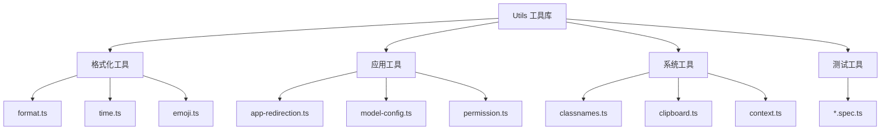

# Utils 工具函数设计文档

## 整体架构



## 工具函数分类

### 1. 格式化工具

#### format.ts
- 数据格式化
- 文本处理
- 数值转换

```typescript
// 格式化函数示例
export function formatNumber(num: number, decimals: number = 2): string {
  return Number(num).toFixed(decimals)
}

export function formatBytes(bytes: number): string {
  const units = ['B', 'KB', 'MB', 'GB', 'TB']
  let i = 0
  while (bytes >= 1024) {
    bytes /= 1024
    i++
  }
  return `${bytes.toFixed(2)} ${units[i]}`
}
```

#### time.ts & timezone.ts
- 时间处理
- 时区转换
- 日期格式化

```typescript
// 时间处理函数示例
export function formatDateTime(date: Date, format: string = 'YYYY-MM-DD HH:mm:ss'): string {
  // 实现时间格式化
  return format.replace(...)
}

export function getTimezoneOffset(timezone: string): number {
  // 获取时区偏移
  return timezoneData[timezone]?.offset || 0
}
```

### 2. 应用工具

#### app-redirection.ts
- 路由重定向
- 页面跳转
- URL 处理

```typescript
// 重定向工具示例
export function redirectToLogin(returnUrl?: string) {
  const url = `/login${returnUrl ? `?returnUrl=${encodeURIComponent(returnUrl)}` : ''}`
  window.location.href = url
}
```

#### permission.ts
- 权限检查
- 访问控制
- 角色验证

```typescript
// 权限检查示例
export function hasPermission(permission: string): boolean {
  const userPermissions = getCurrentUserPermissions()
  return userPermissions.includes(permission)
}
```

### 3. 样式工具

#### classnames.ts
- 类名管理
- 条件样式
- 样式合并

```typescript
// 类名工具示例
export function classNames(...classes: Array<string | Record<string, boolean> | undefined>): string {
  const result: string[] = []
  
  classes.forEach(cls => {
    if (typeof cls === 'string') {
      result.push(cls)
    }
    else if (typeof cls === 'object') {
      Object.entries(cls).forEach(([key, value]) => {
        if (value) result.push(key)
      })
    }
  })
  
  return result.join(' ')
}
```

### 4. 系统工具

#### clipboard.ts
- 剪贴板操作
- 复制文本
- 粘贴处理

```typescript
// 剪贴板工具示例
export async function copyToClipboard(text: string): Promise<boolean> {
  try {
    await navigator.clipboard.writeText(text)
    return true
  } catch (error) {
    console.error('Failed to copy:', error)
    return false
  }
}
```

#### context.ts
- 上下文管理
- 状态共享
- 数据传递

## 实现特点

### 1. 纯函数设计
- 输入确定，输出唯一
- 无副作用
- 易于测试

```typescript
// 纯函数示例
export function sum(a: number, b: number): number {
  return a + b
}

export function capitalize(str: string): string {
  return str.charAt(0).toUpperCase() + str.slice(1)
}
```

### 2. 类型安全
- TypeScript 类型定义
- 参数类型检查
- 返回值类型推导

### 3. 错误处理
- 异常捕获
- 错误提示
- 降级处理

## 测试规范

### 1. 单元测试
```typescript
// classnames.spec.ts 示例
describe('classNames', () => {
  it('should combine string classes', () => {
    expect(classNames('foo', 'bar')).toBe('foo bar')
  })
  
  it('should handle conditional classes', () => {
    expect(classNames({ 'foo': true, 'bar': false })).toBe('foo')
  })
})
```

### 2. 测试覆盖
- 边界条件测试
- 异常情况测试
- 参数组合测试

## 使用指南

### 1. 导入方式
```typescript
// 推荐的导入方式
import { formatDateTime } from '@/utils/time'
import { classNames } from '@/utils/classnames'
import { hasPermission } from '@/utils/permission'
```

### 2. 错误处理
```typescript
// 错误处理示例
try {
  const result = riskyOperation()
  // 处理结果
} catch (error) {
  console.error('Operation failed:', error)
  // 错误处理
}
```

### 3. 性能优化
```typescript
// 缓存计算结果
const memoizedFn = memoize((value: string) => {
  // 复杂计算
  return expensiveOperation(value)
})
```

## 最佳实践

### 1. 函数设计
- 功能单一
- 参数合理
- 命名清晰

### 2. 代码组织
- 按功能分类
- 合理导出
- 文档完善

### 3. 性能考虑
- 避免重复计算
- 优化算法
- 减少副作用

## 开发指南

### 1. 添加新工具
1. 创建功能文件
2. 编写函数实现
3. 添加类型定义
4. 编写单元测试
5. 更新文档说明

### 2. 修改既有工具
1. 确保兼容性
2. 更新测试用例
3. 修改相关文档
4. 检查使用影响

### 3. 代码规范
- 遵循项目规范
- 注释完善
- 类型完整
- 测试覆盖

## 注意事项

### 1. 通用性
- 保持功能通用
- 避免业务耦合
- 考虑可复用性

### 2. 维护性
- 清晰的文档
- 完整的测试
- 规范的命名

### 3. 性能优化
- 算法优化
- 缓存结果
- 避免冗余
